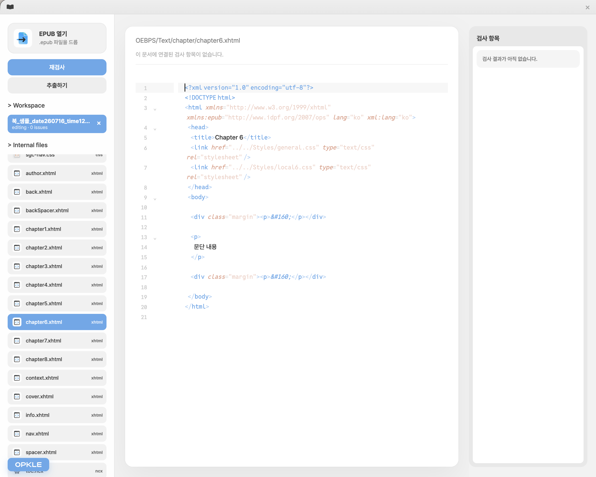
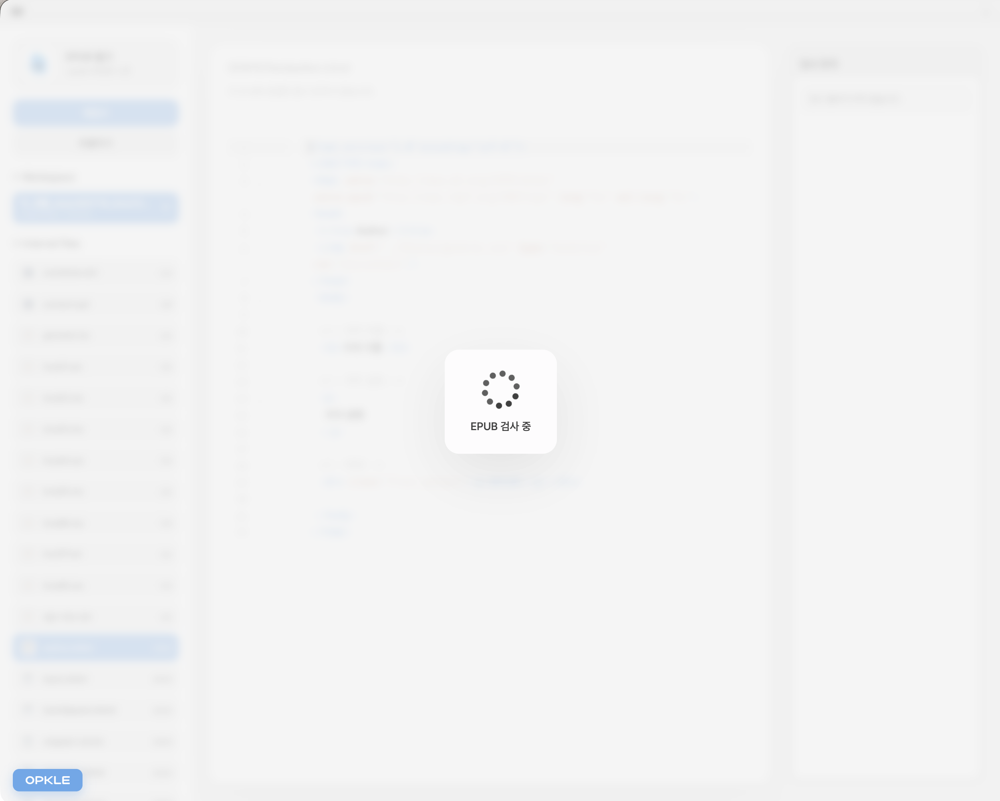
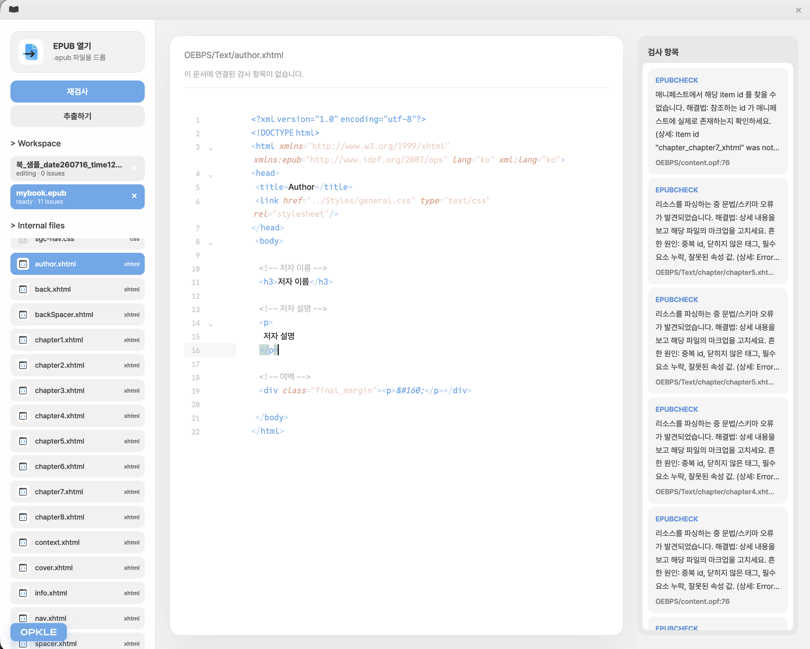
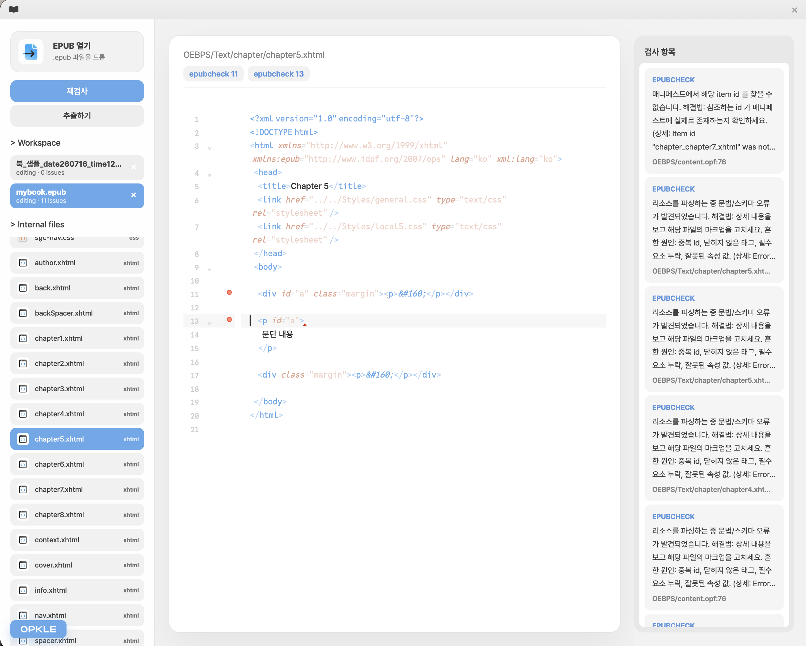
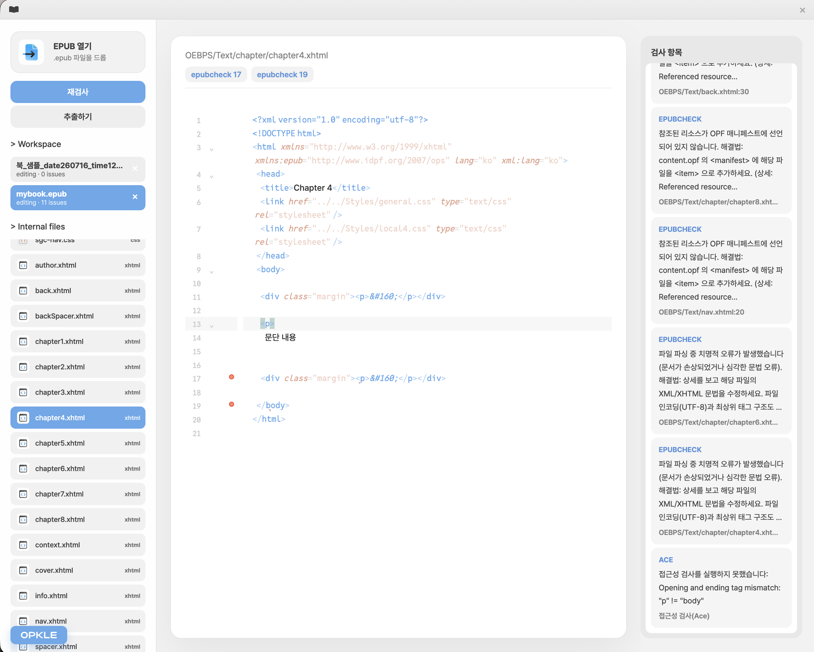
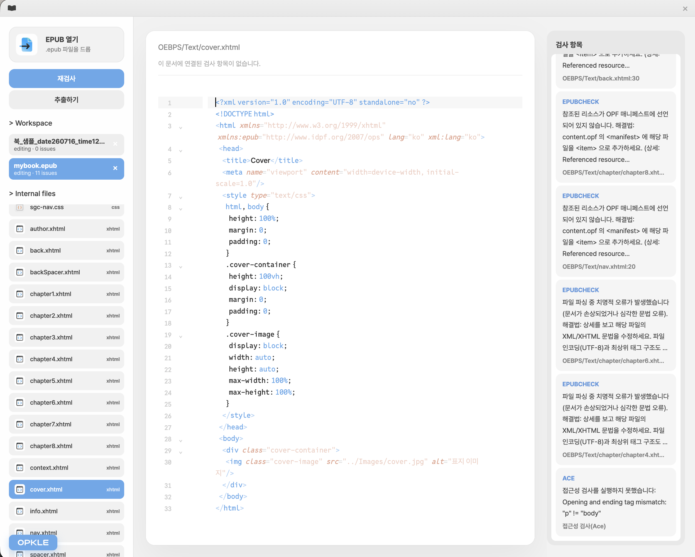

# EpubChecker

[English](#english) · [한국어](#한국어)

## English

EpubChecker is a local-first Electron desktop app for opening EPUB files, running W3C EPUBCheck and Ace by DAISY accessibility inspections, editing internal XHTML/OPF/CSS/XML documents, rebuilding repaired EPUBs, and validating them again.

**EpubChecker is free and open-source software created and distributed by [Opkle](https://opkle.app).**

The interface supports both English and Korean. On first launch, Korean is selected only when the operating system's primary preferred language is Korean; every other language defaults to English. A user's explicit `KO / EN` selection is saved and takes priority on later launches.

### Screenshots

Click a screenshot to view it at full size.

<table>
  <tr>
    <td width="50%" align="center">
      <a href="./renderer/static/screenShot0.png"></a><br>
      <sub>Browse internal EPUB files and edit them with CodeMirror</sub>
    </td>
    <td width="50%" align="center">
      <a href="./renderer/static/screenShot1.png"></a><br>
      <sub>Run EPUBCheck and accessibility inspection locally</sub>
    </td>
  </tr>
  <tr>
    <td width="50%" align="center">
      <a href="./renderer/static/screenShot2.png"></a><br>
      <sub>Work with multiple EPUBs and structured issue lists</sub>
    </td>
    <td width="50%" align="center">
      <a href="./renderer/static/screenShot3.png"></a><br>
      <sub>Navigate from an issue directly to its file and line</sub>
    </td>
  </tr>
  <tr>
    <td width="50%" align="center">
      <a href="./renderer/static/screenShot4.png"></a><br>
      <sub>Combined EPUBCheck and Ace by DAISY results</sub>
    </td>
    <td width="50%" align="center">
      <a href="./renderer/static/screenShot5.png"></a><br>
      <sub>Edit XHTML and CSS while reviewing related issues</sub>
    </td>
  </tr>
</table>

### Why EpubChecker Exists

Repairing an EPUB usually means switching repeatedly between several tools:

- Run EPUBCheck to find standards-conformance errors.
- Run Ace by DAISY to identify accessibility problems.
- Extract the EPUB archive and locate the affected XHTML, OPF, CSS, or XML document.
- Edit the document, rebuild the EPUB, and inspect it again.

EpubChecker brings that workflow into one local workspace. Original books and in-progress edits remain on the user's computer.

### Current Features

- Free Apache-2.0 open-source software by [Opkle](https://opkle.app)
- English and Korean UI with an instant `KO / EN` switch
- OS-language detection with English as the default for non-Korean environments
- Electron desktop application with isolated renderer, preload, and main-process layers
- Open `.epub` files through drag and drop or the native file picker
- One app-level workspace tab per EPUB
- Open and switch between multiple EPUB workspaces
- JSZip-based in-memory EPUB workspaces
- Browse and edit XHTML, HTML, OPF, NCX, XML, CSS, and TXT documents
- CodeMirror 6 editor with format-specific language support
- CodeMirror diagnostics and lint-gutter markers for inspection issues
- Navigate from an issue to the affected internal file and line
- Debounced automatic saving into the in-memory workspace
- Rebuild and export repaired EPUB files to a user-selected location
- Validate the current edited workspace before export
- W3C EPUBCheck JSON parsing with a stdout fallback
- English source messages and reviewed Korean EPUBCheck explanations
- Ace by DAISY accessibility inspection
- Inspection results that switch between English and Korean without rerunning validation
- Local JRE, EPUBCheck jar, and Chromium runtime resolution
- Launcher setup for Intel Mac, Apple Silicon Mac, Windows x64, and Linux x64

### Local-First and Privacy

Local processing is the central product rule:

- EPUB contents are never uploaded to a server.
- Language selection does not use IP geolocation or an external detection service.
- The renderer does not access Node.js APIs directly.
- Renderer code uses only the narrow `window.electronAPI` surface exposed by preload.
- The Electron main process acts as the local backend.
- JRE, EPUBCheck, and Chromium runtimes are resolved locally.

Chromium required for accessibility inspection may be downloaded to the user's device when it is first needed. The download prepares a local inspection runtime; it does not upload EPUB contents.

### Install

Windows users can install the signed Store version and receive updates through Microsoft Store:

[Get EpubChecker from Microsoft Store](https://apps.microsoft.com/detail/9N0JG57QCLR1)

macOS and Linux packages are available from [GitHub Releases](https://github.com/opkle-app/epub-checker/releases).

### Quick Start for Development

```bash
npm install
npm run launcher:setup
npm run dev
```

`npm run launcher:setup` prepares portable runtimes under `launcher/{platform}/` for the current operating system and CPU architecture.

Run the complete non-GUI verification suite with:

```bash
npm run verify
```

### Launcher Setup

EPUBCheck is a Java jar, while Ace by DAISY requires Chromium. EpubChecker prefers portable runtimes under `launcher/` instead of depending on system-wide installations.

```bash
npm run launcher:setup
npm run launcher:setup:rebuild
```

Explicit platform targets are also available:

```bash
npm run launcher:setup:mac:x64
npm run launcher:setup:mac:arm64
npm run launcher:setup:win:x64
```

Playwright downloads Chromium for the host operating system only. Run launcher setup on Windows to prepare the Windows Chromium runtime. To prepare only JRE and EPUBCheck during a cross-platform setup, use `SKIP_CHROMIUM=1`.

See [launcher/README.md](./launcher/README.md) for the full runtime layout.

### Architecture

```text
Renderer
  UI, localization, EPUB tabs, file list, issue list, CodeMirror editor

Preload
  narrow window.electronAPI bridge

Electron main
  local backend: native dialogs, zip workspace, validation, export, runtimes
```

Data follows this boundary:

```text
UI -> WorkspaceStore -> ElectronBridge -> window.electronAPI -> preload -> main
```

The renderer must not access the filesystem, child processes, or Node modules directly.

### Workspace and Validation Model

One EPUB corresponds to one backend session and one renderer workspace tab. Each workspace independently preserves its active internal file, editor contents, dirty files, inspection issues, export path, and progress state.

Inspection results retain structured data such as source, rule code, severity, internal file path, line, column, raw English message, suggestion, and additional occurrence count. The renderer uses this locale-neutral data to present English or reviewed Korean output without rerunning EPUBCheck or Ace.

### Development Commands

```bash
npm run renderer:build
npm run renderer:watch
npm run tsc
npm run tsc:preload
npm run build:all
npm run check
npm run verify
npm run dev
npm run start
```

### Contributing

- Do not introduce server upload paths for EPUB contents.
- Do not access Node APIs from the renderer.
- Keep preload, renderer types, and `ElectronBridge` synchronized when changing IPC.
- Keep backend session keys and renderer workspace tab keys aligned as `workspaceId`.
- Do not commit runtime binaries under `launcher/`.
- Read [docs/RENDERER_GUIDE.md](./docs/RENDERER_GUIDE.md) before changing renderer code.
- See [docs/PROJECT_GUIDE.md](./docs/PROJECT_GUIDE.md) for the broader project architecture.

### License

EpubChecker is provided free of charge by [Opkle](https://opkle.app) and distributed under the Apache License 2.0. See [LICENSE](./LICENSE).

Bundled fonts retain their own licenses:

- [Pretendard](https://github.com/orioncactus/pretendard) — SIL Open Font License 1.1 ([license text](./renderer/designSource/font/pretendard/LICENSE))
- [Reddit Mono](https://github.com/reddit/redditsans) — SIL Open Font License 1.1 ([license text](./renderer/designSource/font/redditmono/LICENSE.txt))

---

## 한국어

EpubChecker는 EPUB 파일을 로컬에서 열고, W3C EPUBCheck와 Ace by DAISY 접근성 검사를 실행하고, EPUB 내부의 XHTML/OPF/CSS/XML 파일을 직접 수정한 뒤, 수정본 EPUB을 다시 만들고 재검사하는 Electron 데스크톱 앱입니다.

**EpubChecker는 [Opkle](https://opkle.app)이 만들고 배포하는 무료 오픈 소스 소프트웨어입니다.**

### 스크린샷

스크린샷을 클릭하면 원본 크기로 확인할 수 있습니다.

<table>
  <tr>
    <td width="50%" align="center">
      <a href="./renderer/static/screenShot0.png"></a><br>
      <sub>EPUB 내부 파일 탐색 및 CodeMirror 편집</sub>
    </td>
    <td width="50%" align="center">
      <a href="./renderer/static/screenShot1.png"></a><br>
      <sub>EPUBCheck 및 접근성 검사 실행</sub>
    </td>
  </tr>
  <tr>
    <td width="50%" align="center">
      <a href="./renderer/static/screenShot2.png"></a><br>
      <sub>여러 EPUB 작업공간과 구조화된 이슈 목록</sub>
    </td>
    <td width="50%" align="center">
      <a href="./renderer/static/screenShot3.png"></a><br>
      <sub>편집기 진단 표시 및 이슈 위치 탐색</sub>
    </td>
  </tr>
  <tr>
    <td width="50%" align="center">
      <a href="./renderer/static/screenShot4.png"></a><br>
      <sub>EPUBCheck와 Ace by DAISY 결과 통합</sub>
    </td>
    <td width="50%" align="center">
      <a href="./renderer/static/screenShot5.png"></a><br>
      <sub>XHTML·CSS 편집과 실시간 문제 확인</sub>
    </td>
  </tr>
</table>

### 제작 목적

EPUB을 실제로 고치려면 보통 여러 도구를 오가야 합니다.

- EPUBCheck로 표준 오류를 검사합니다.
- Ace by DAISY로 접근성 문제를 확인합니다.
- EPUB zip을 풀고 내부 XHTML, OPF, CSS, XML 파일을 찾아 수정합니다.
- 다시 zip으로 묶고, 다시 검사하고, 문제가 없어질 때까지 반복합니다.

EpubChecker는 이 반복 작업을 하나의 로컬 작업 공간으로 묶는 것을 목표로 합니다. 원본 EPUB과 수정 중인 EPUB 내용은 사용자의 컴퓨터 안에만 머뭅니다.

### 주요 기능

- [Opkle](https://opkle.app)이 무료로 제공하는 Apache-2.0 오픈 소스 소프트웨어
- 한국어·영어 UI와 즉시 전환 가능한 `KO / EN` 토글
- 한국어가 아닌 운영체제 환경에서는 영어를 기본 언어로 선택
- Electron 기반 로컬 데스크톱 앱
- renderer, preload, main process를 분리한 안전한 IPC 구조
- 드래그 앤 드롭 또는 파일 선택창으로 `.epub` 열기
- EPUB 하나를 앱 내부 workspace 탭 하나로 관리
- 여러 EPUB workspace를 동시에 열고 전환
- JSZip 기반 EPUB zip workspace
- EPUB 내부 편집 가능 파일 목록 표시
- XHTML, HTML, OPF, NCX, XML, CSS, TXT 파일 읽기 및 수정
- CodeMirror 6 기반 편집기
- XML/HTML/CSS 파일 종류별 CodeMirror language extension
- 검사 오류를 CodeMirror diagnostic/lint gutter로 표시
- 이슈 클릭 시 EPUB 내부 파일과 줄 위치로 이동
- 수정 내용을 메모리의 EPUB workspace에 자동 저장
- 수정본 EPUB 재생성 및 사용자 지정 경로 export
- export 전에 현재 workspace를 임시 EPUB으로 빌드하고 재검사
- W3C EPUBCheck JSON 결과 파싱과 stdout fallback
- EPUBCheck 메시지의 한국어 친화 설명 매핑
- 재검사 없이 한국어·영어로 전환되는 구조화된 검사 결과
- Ace by DAISY 접근성 검사 연결
- 로컬 JRE, EPUBCheck jar, Chromium runtime resolver
- Intel Mac, Apple Silicon Mac, Windows x64용 launcher setup script

### 로컬 우선 원칙

이 프로젝트의 가장 중요한 원칙은 EPUB 처리 과정을 로컬에서 끝내는 것입니다.

- EPUB 파일을 서버로 업로드하지 않습니다.
- renderer는 Node.js API에 직접 접근하지 않습니다.
- renderer는 preload가 노출한 `window.electronAPI`만 사용합니다.
- Electron main process가 로컬 백엔드 역할을 맡습니다.
- JRE, EPUBCheck, Chromium 같은 실행 파일은 `launcher/` 아래에서 해석합니다.

### 개발 빠른 시작

```bash
npm install
npm run launcher:setup
npm run dev
```

`npm run launcher:setup`은 현재 OS와 CPU에 맞는 portable runtime을 `launcher/{platform}/`에 준비합니다. 예를 들어 Apple Silicon Mac에서는 `launcher/darwin-arm64`, Intel Mac에서는 `launcher/darwin-x64`, Windows x64에서는 `launcher/win32-x64`를 사용합니다.

검증만 하고 Electron을 띄우지 않으려면:

```bash
npm run check
```

### Launcher 설정

EPUBCheck는 Java jar이고, Ace by DAISY는 Chromium을 필요로 합니다. EpubChecker는 시스템 전역 설치에 기대지 않고 `launcher/` 폴더에 있는 portable runtime을 우선 사용합니다.

현재 머신 기준 자동 설치:

```bash
npm run launcher:setup
```

기존 runtime을 강제로 다시 받기:

```bash
npm run launcher:setup:rebuild
```

플랫폼을 명시해서 실행:

```bash
npm run launcher:setup:mac:x64
npm run launcher:setup:mac:arm64
npm run launcher:setup:win:x64
```

Playwright Chromium은 현재 실행 중인 OS용 바이너리만 내려받습니다. Windows용 Chromium은 Windows에서 `npm run launcher:setup`을 실행해야 합니다. 다른 OS에서 JRE와 EPUBCheck만 미리 준비하려면 다음처럼 Chromium을 건너뜁니다.

```bash
SKIP_CHROMIUM=1 npm run launcher:setup:mac:arm64
```

자세한 내용은 [launcher/README.md](./launcher/README.md)를 참고하세요.

### 아키텍처

EpubChecker는 세 레이어로 나뉩니다.

```text
Renderer
  UI, EPUB workspace tabs, file list, issue list, CodeMirror editor

Preload
  safe window.electronAPI bridge

Electron main
  local backend: file dialog, zip workspace, validation, export
```

데이터 흐름은 아래 방향을 유지합니다.

```text
UI -> WorkspaceStore -> ElectronBridge -> window.electronAPI -> preload -> main
```

renderer가 파일 시스템, child process, Node module에 직접 접근하지 않도록 이 경계를 지키는 것이 중요합니다.

### 프로젝트 구조

```text
source/main.ts
  Electron app entry, BrowserWindow setup, IPC handlers, local backend wiring.

source/preload.ts
  Narrow IPC surface exposed as window.electronAPI.

source/apps/launcherRuntime.ts
  Resolves local JRE, EPUBCheck jar, and Chromium from launcher/.

scripts/setup-launcher.mjs
  Downloads and installs launcher runtime files for the current platform.

source/apps/epubWorkspace.ts
  Keeps one JSZip workspace per opened EPUB and exports repaired EPUB files.

source/apps/epubMaker/epubMaker.ts
  Runs EPUBCheck, parses results, and combines Ace accessibility issues.

source/apps/epubMaker/module/aceByDaisy.ts
  Runs Ace by DAISY through Playwright and local Chromium.

source/apps/epubMaker/module/epubCheckMessageKo.ts
  Maps EPUBCheck messages into Korean-friendly explanations.

source/apps/abstractNode/abstractNode.ts
  Renderer build orchestrator.

source/apps/abstractNode/src/app.ts
  Renderer boot entry.

source/apps/abstractNode/src/core/electronBridge.ts
  Renderer-side wrapper around window.electronAPI.

source/apps/abstractNode/src/core/workspaceStore.ts
  Renderer state machine for multi-EPUB workspaces.

source/apps/abstractNode/src/core/issueMapper.ts
  Maps validation issues to EPUB internal file paths and line/column targets.

source/apps/abstractNode/src/ui/appController.ts
  Main UI layout and rendering.

source/apps/abstractNode/src/editor/editorPane.ts
  CodeMirror 6 editor adapter.

renderer/
  Generated renderer output. The build must create index.html and main.mjs.

launcher/
  Local runtime binaries. This folder is gitignored except launcher/README.md.
```

### 작업 공간 모델

EPUB 파일 하나는 하나의 backend session이자 하나의 renderer workspace tab입니다.

```text
EpubAppState
  tabs: EpubWorkspaceState[]
  activeWorkspaceId: string
  activeWorkspace: EpubWorkspaceState
  message: LocalizedMessage
```

각 workspace는 다음 정보를 보관합니다.

- 원본 EPUB 경로
- 표시용 파일명
- 편집 가능한 EPUB 내부 파일 목록
- 현재 열린 내부 파일 경로
- 현재 편집 중인 파일 내용
- 검사 결과와 접근성 이슈
- 수정본 EPUB export 경로
- 현재 진행 상태와 상태 메시지

탭을 전환해도 각 EPUB의 파일 목록, 편집 내용, 이슈 목록, export 상태가 독립적으로 유지되어야 합니다.

### Backend IPC 흐름

```text
workspace:open
  read .epub from disk
  load JSZip
  create workspaceId
  list editable internal files

workspace:get-file
  read one internal EPUB text file

workspace:update-file
  replace one internal file in the in-memory JSZip workspace
  mark that file dirty

workspace:inspect
  flush renderer auto-save first
  export workspace to a temporary repaired EPUB
  run EPUBCheck and Ace locally
  return structured issues

workspace:export-as
  show save dialog
  write repaired EPUB to the selected path
```

### 검사 결과 구조

검사 결과는 renderer와 editor에서 쓰기 쉽도록 아래 형태로 정규화합니다.

```ts
interface EpubInspectError {
  fileName: string;
  line: string;
  error: string;
  severity?: "fatal" | "error" | "warning" | "usage" | "info";
  code?: string;
  lineNumber?: number;
  column?: number;
  rawMessage?: string;
  suggestion?: string;
  additionalLocations?: number;
  filePath?: string;
  source?: "epubcheck" | "ace";
}
```

UI는 사람이 읽기 쉬운 설명을 보여주되, `rawMessage`, `code`, `filePath`, `lineNumber`, `column` 같은 원본에 가까운 데이터는 디버깅과 issue navigation을 위해 보존해야 합니다.

### 개발 명령어

```bash
npm run renderer:build
npm run renderer:watch
npm run tsc
npm run tsc:preload
npm run build:all
npm run check
npm run dev
npm run start
```

- `npm run renderer:build`: renderer bundle 생성
- `npm run renderer:watch`: renderer watch build
- `npm run build:all`: renderer, main, preload 전체 빌드
- `npm run check`: Electron 실행 없이 빌드 검증
- `npm run dev`: 전체 빌드 후 Electron 실행
- `npm run start`: 이미 빌드된 Electron app 실행

### 현재 보완할 부분

- 긴 검사 작업의 세부 progress/cancel UI는 더 보강할 예정입니다.
- 테스트용 sample EPUB fixture와 자동화된 end-to-end QA는 더 보강해야 합니다.
- 더 많은 EPUBCheck/Ace 규칙의 한국어 설명을 지속해서 검수·보강할 예정입니다.

### 기여 안내

- EPUB 처리 과정에 서버 업로드 경로를 만들지 마세요.
- renderer에서 Node API를 직접 사용하지 마세요.
- preload API를 늘릴 때는 `source/preload.ts`, renderer type, `ElectronBridge`를 함께 맞추세요.
- backend session key와 renderer workspace tab key는 같은 `workspaceId`입니다.
- `launcher/`의 runtime binary는 커밋하지 마세요.
- renderer 코드를 바꾸기 전에는 [docs/RENDERER_GUIDE.md](./docs/RENDERER_GUIDE.md)를 읽어주세요.
- 전체 구조를 이어받아 개발할 때는 [docs/PROJECT_GUIDE.md](./docs/PROJECT_GUIDE.md)를 참고하세요.

### 라이선스

EpubChecker는 [Opkle](https://opkle.app)이 무료로 제공하며, Apache License 2.0으로 배포됩니다. 자세한 내용은 [LICENSE](./LICENSE)를 참고하세요.

렌더러에 번들된 폰트는 별도 라이선스를 따릅니다.

- [Pretendard](https://github.com/orioncactus/pretendard) — SIL Open Font License 1.1 ([전체 텍스트](./renderer/designSource/font/pretendard/LICENSE))
- [Reddit Mono](https://github.com/reddit/redditsans) — SIL Open Font License 1.1 ([전체 텍스트](./renderer/designSource/font/redditmono/LICENSE.txt))

<p align="center">Made by <a href="https://opkle.app">Opkle</a>.</p>
